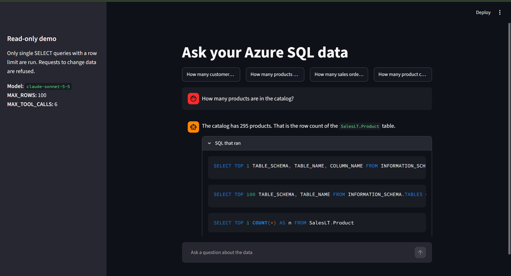

# Azure SQL Agent

[](https://github.com/Feiiiisal/azure-sql-agent/actions/workflows/tests.yml)

[](LICENSE)


An AI agent that answers plain-English questions about data by querying an
Azure SQL Database through an MCP (Model Context Protocol) server.



## Features

- **Ask in plain English.** Claude inspects the schema, writes the SQL and explains the result.
- **Always shows its work.** Every answer includes the exact SQL that ran, plus token usage and tool-call count.
- **Read-only by design.** Three layers (a `db_datareader` database user, a read-only MCP tool list, and an agent-side single-`SELECT` guard) mean a prompt injection cannot change data.
- **Bounded cost and runtime.** Capped output tokens, a tool-call limit, a row limit and a query timeout.
- **No secrets in code.** All settings come from `.env`; error messages are scrubbed of secrets and server names.
- **Handles a paused serverless database**: it waits for the database to wake up and retries.
- **CLI and Streamlit UI**, with a unit-tested query guard and a live eval set.

## Goal

Let a non-technical user ask a question like:

> "Which five products had the highest sales last quarter?"

The agent will:

1. Understand the question.
2. Inspect the database schema using tools the MCP server provides.
3. Write a **read-only** SQL query (`SELECT` only).
4. Run the query through the MCP server.
5. Give a clear plain-English answer and show the SQL it used, so the result
   can be checked.

## Architecture

```
 you ──question──▶  cli.py
                      │
                      ▼
                  agent.py  ◀────────────▶  Claude API (Anthropic SDK)
                (the agent loop,             "call a tool" / "here's the answer"
                 max 6 tool calls)
                      │ tool call: run_query(sql)
                      ▼
                  guard.py   ── rejects anything but ONE limited SELECT
                      │
                      ▼
                  mcp_tools.py ──stdio──▶ MCP server (scripts/run_mssql_mcp.py)
                                              │  read-only tools, MAX_ROWS,
                                              │  QUERY_TIMEOUT_SECONDS
                                              ▼
                                       Azure SQL Database
                                       (db_datareader user only)
```

How one question flows:

1. `cli.py` reads the question and calls `agent.ask()`.
2. `agent.py` sends it to Claude with the MCP tools (`run_query`, `get_object`).
3. If Claude asks for a tool, the agent runs it and sends the result back. This
   repeats until Claude gives a final answer or the tool-call cap is reached.
4. Every `run_query` passes through `guard.py` first.
5. The CLI prints the answer, the exact SQL that ran, and the token usage.

Three layers keep the database read-only, so no single mistake can cause a write:
the database user (`db_datareader`), the MCP server (read tools only, no write
tool), and the agent's guard (single `SELECT` with a row limit).

- **LLM:** Claude (`claude-sonnet-5-5`, set with `ANTHROPIC_MODEL`) through the
  official `anthropic` SDK.
- **Tools:** provided by the MCP server. The agent never opens a database
  connection itself, and the model can only set `sql`/`parameters`, not the
  profile, catalog or snapshot options.
- **Config:** every setting comes from a `.env` file that is never committed.

## Setup

```bash
python -m venv .venv
# Windows
.venv\Scripts\activate
# macOS/Linux
source .venv/bin/activate

pip install -r requirements.txt
cp .env.example .env   # then fill in real values; never commit .env
```

You also need the .NET global tool that `scripts/run_mssql_mcp.py` launches:

```bash
dotnet tool install --global Alyio.McpMssql --prerelease
```

Settings in `.env` (see `.env.example`): `ANTHROPIC_API_KEY`, `ANTHROPIC_MODEL`,
`MAX_TOKENS` (default 1024), `MAX_TOOL_CALLS` (default 6), `MAX_ROWS`,
`QUERY_TIMEOUT_SECONDS`, and the `AZURE_SQL_*` connection settings. A missing
required variable stops the program with a message naming it (never its value).

## Usage

```bash
python -m src.agent.cli                      # interactive
python -m src.agent.cli "How many customers are there?"   # one question
```

Each answer shows the result, the SQL that produced it, and token usage. If the
serverless database is paused, the agent says it is waking up and retries.

## Web UI (Streamlit)

```bash
pip install -r requirements.txt
streamlit run app.py
```

Opens a chat page with four clickable example questions. Each answer shows the
result, an expandable "SQL that ran" section, and token usage with the number of
tool calls. The sidebar shows the model, `MAX_ROWS` and `MAX_TOOL_CALLS` (never
secrets or the server name). `app.py` only draws the page: questions go through
the same agent loop and SELECT-only guard as the CLI, using one MCP session kept
alive by `src/agent/runtime.py`. Each question is answered on its own (the chat
does not remember earlier turns).

## Tests

```bash
pytest                          # offline: query-guard unit tests + UI smoke test (no API/DB needed)
python -m tests.run_evals       # live: 10 SalesLT questions + a "delete all customers" refusal
RUN_LIVE=1 pytest tests/test_refusal_live.py   # live refusal test as a pytest
```

The eval set is `tests/eval_set.json`. An answer passes if it contains the
expected values (no second model acts as judge, so it is cheap and repeatable).

## How I'd take this to production on Azure

- **No static secrets.** Replace the SQL username/password with Microsoft Entra
  (Azure AD) authentication. Run the agent on Azure Container Apps or App
  Service with a **managed identity**, create a contained database user from it
  (`CREATE USER [app-name] FROM EXTERNAL PROVIDER`) and give it only
  `db_datareader`. The app then gets short-lived tokens, so there is no password
  to leak or rotate.
- **Identity federation.** For CI/CD and anything running outside Azure (for
  example GitHub Actions), use workload identity federation (OIDC): the
  pipeline proves who it is with a short-lived token that Entra trusts, instead
  of a stored client secret.
- **Remaining secrets** (the Anthropic API key) go in Azure Key Vault, read via
  the managed identity, never in `.env` or the image.
- **Network and data:** private endpoint for Azure SQL, firewall closed to the
  internet, and a read replica or restricted views so the agent can only see
  the tables it needs.
- **Operations:** Application Insights for latency and token usage, per-user
  rate limits and a spend cap, and audit logs of every question and SQL run
  (with no secrets or personal data in them).
- **Tool server:** run the MCP server as its own service with its own identity,
  so the agent and the database credentials are separated.

## Safety principles

- Read-only database access, enforced in three places: the database user's
  permissions, the MCP server's tool list, and query validation in the agent.
- No hardcoded credentials. All secrets live in `.env`.
- Results are capped by a row limit, and queries are capped by a timeout.

See `CLAUDE.md` for the full project rules.
